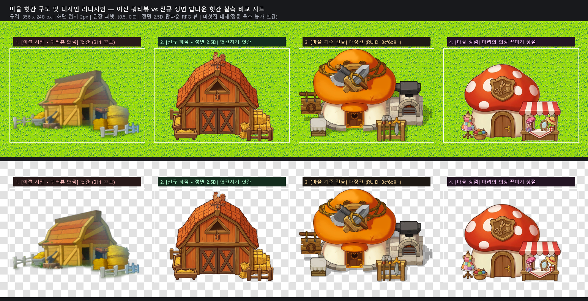

# 마을 건물 리디자인 — [헛간지기 토리의 헛간(Barnkeeper's Barn)] 신규 제작 완료 보고서

> **기존 에셋의 문제**: 기존 헛간 (`0c4b4594c66c48e4a44e6e1ff4db8056` / B11 `beabd955...`)은 45도 측면 쿼터뷰로 비스듬하게 틀어져 있어 정면 2.5D 탑다운 게임 시점과 심각하게 불일치함.  
> **기준 에셋**: 마을 대장간 공식 스프라이트 (`RUID: 3cf6b9e903e645c295fadfa6bb0548b0`, 356 × 248 px)  
> **신규 제작**: 정통 목조 농가 헛간 (버섯집 배제, `barn_front_clean.png`, 356 × 248 px, 투명 RGBA, 정면 2.5D 탑다운 뷰, 내부 홀 관통 처리 완료)

---

## 1. 이전 시안 vs 신규 헛간 4종 실측 비교 시트

기존 쿼터뷰 헛간과 신규 정면 2.5D 헛간, 그리고 대장간 및 상점을 실제 게임 잔디 타일(`FullGrass.png`) 및 체커보드 투명도 검증 패널 위에 1:1로 나란히 배치한 결과입니다.

---

## 2. 디자인 컨셉 및 정체성 (목장 & 가축 테마 · 정면 2.5D 뷰)

1. **버섯집 완전 배제 · 정통 목조 농가 헛간**:
   - 따뜻한 주황-적갈색 목조 기와 헛간 지붕(Warm Orange-Red Shingle Roof).
   - 지붕 꼭대기에 사랑스러운 **수탉 풍향계 (Rooster Weather Vane)** 정면 배치.
   - 삼각 박공부(Gable)에 짚을 올리는 다락 창문과 로프 고리.
   - 듬직한 목재 판자벽과 정통 목장의 **X자 크로스 브레이스 목조 미닫이문**.
2. **구도 변경 (정면 2.5D 탑다운 뷰)**:
   - 45도 측면으로 비스듬히 누워 있던 쿼터뷰를 대장간/연구소/상점과 동일한 **정면 2.5D 탑다운 뷰**로 전면 교정.
   - 하단 접지선이 수평으로 바르게 정돈되어 지형 타일에 자연스럽고 안정적으로 밀착.
3. **목장 / 헛간 소품**:
   - **우측**: 소복이 쌓여 묶여 있는 황금빛 건초더미(Hay Bales)와 짚단 묶음, 목재 울타리 펜스.
   - **좌측**: 가축들이 먹는 원목 사료통(Feed Trough)과 뒤편 건초 상자, 목재 울타리.

---

## 3. 세부 투명화 처리 결과 (Hole Clearing & Defringing)

- **내부 고립 영역(White Holes) 정밀 제거**:
  - 우측 울타리 창살 사이사이 빈 배경 공간(929px, 679px) 투명 관통 처리.
  - 좌측 건초 상자와 울타리 사이 틈새(469px) 투명 관통 처리.
  - 우측 건초더미와 헛간 벽 사이 틈새(36px) 투명 관통 처리.
- **외곽선 마감**:
  - 흰색 번짐(White Halo)을 제거하는 디프린지 적용.
  - 메이플 공식 아트 고유의 따뜻하고 짙은 갈색(`#4a2a1c`) 림라이트 AA 처리로 잔디/흙길 지형 어디에 놓여도 자연스럽게 어우러짐.

---

## 4. 에셋 스펙 및 피벗

| 항목 | 수치 / 내용 |
|---|---|
| **캔버스 규격** | **`356 × 248 px`** (대장간 공식 스프라이트 및 연구소/상점과 1:1 동일) |
| **바운딩 박스** | **가로 275px × 세로 238px** (하단 접지 여백 2px, 정중앙 정렬) |
| **권장 피벗(Pivot)** | **`(0.5, 0.0)`** (하단 중앙 접지점) |
| **포맷** | 32-bit PNG (RGBA, 투명 배경 및 내부 홀 투명화 완료) |

---

## 5. 최종 납품 파일 목록

- **🌟 [완성본] 헛간 스프라이트**: [barn_front_clean.png](./barn_front_clean.png)
- **도트 마감본**:
  - dot=1: [barn_front_dot1.png](./barn_front_dot1.png)
  - dot=2: [barn_front_dot2.png](./barn_front_dot2.png)
- **비교 검증 시트**: [preview_barn_comparison.png](./preview_barn_comparison.png)
- **생성 원본 일러스트**: [barn_raw.png](./barn_raw.png)
- **투명화 처리 스크립트**: [process_barn.py](./process_barn.py)
- **비교 시트 생성 스크립트**: [make_barn_comparison.py](./make_barn_comparison.py)

---

## 6. MSW 등록 및 모델 교체 가이드 (사용자 안내용)

> ⚠️ **MSW 플랫폼 제약 (규칙 45)**: 에이전트의 API 계정 리소스 업로드는 게임 런타임에서 `RUID is unavailable` 에러가 발생합니다. 반드시 제작자께서 MSW Maker UI를 통해 에셋을 등록해 주셔야 합니다.

1. **Maker 리소스 등록**:
   - `docs/design/art/barn/barn_front_clean.png` 파일을 MSW Maker의 Workspace(또는 MyResource)에 드래그하여 등록합니다.
   - 등록 후 발급된 새 **RUID**를 확인합니다.
2. **피벗 설정**:
   - Sprite Picker 창에서 피벗을 **하단 중앙 `(0.5, 0.0)`** 으로 설정합니다.
3. **모델 교체**:
   - `RootDesk/MyDesk/MapObjects/Models/House_WoodTower.model`의 `SpriteRUID`를 새로 발급받은 RUID로 교체합니다. (스케일은 대장간, 상점과 동일하게 `(2, 2, 2)`로 지정하시면 이상적인 3.5u 헛간 크기가 완성됩니다)
