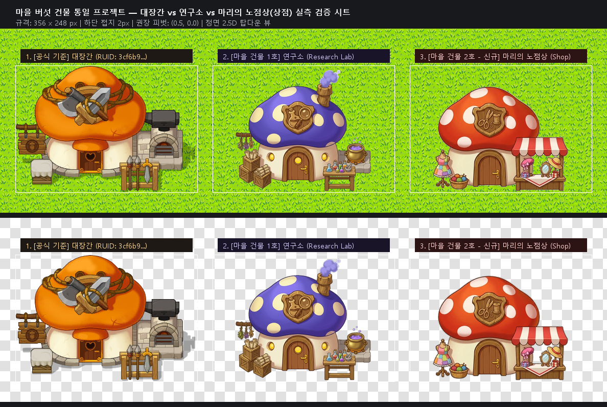

# 마을 버섯 건물 교체 — [마리의 의상·꾸미기 상점(Marie's Boutique Shop)] 신규 제작 완료 보고서

> **기준 에셋**: 마을 대장간 공식 스프라이트 (`RUID: 3cf6b9e903e645c295fadfa6bb0548b0`, 356 × 248 px) & 연금술/마법 연구소 (`docs/design/art/researchlab/researchlab_front_clean.png`, 356 × 248 px)  
> **신규 제작**: 의복/코스튬 및 인테리어 꾸미기 아이템 전문 노점상 버섯 하우스 (`mari_shop_front_clean.png`, 356 × 248 px, 투명 RGBA, 정면 2.5D 탑다운 뷰, 굴뚝 완전 제거 및 컴팩트 정면 배치)

---

## 1. 디자인 컨셉 및 정체성 (의복 & 꾸미기 전문 샵 · 굴뚝 없는 둥근 지붕)

화덕이나 가마솥이 없어 불을 피우지 않는 부티크 의상실의 특성에 맞춰 **굴뚝을 완전히 제거**하고, 둥글고 부드러운 헤네시스풍 붉은 버섯 갓의 본래 매력을 극대화했습니다.

1. **지붕 & 엠블럼**:
   - 매끄럽고 둥근 **붉은색 버섯 갓(Red Mushroom Cap)** + 아이보리 물방울 도트 무늬.
   - 중앙 목조 방패 엠블럼에 **재단 가위와 실타래/실패(Tailor Scissors & Thread Spool)** 조각으로 의상실 정체성 확립.
   - 불을 피우는 시설이 아니므로 **굴뚝과 연기를 완전히 제거하여 깔끔하고 사랑스러운 실루엣 완성**.
2. **좌측 전면 디스플레이**:
   - **패치워크 원피스 마네킹**: 사랑스러운 메이플풍 패치워크 원피스를 입은 아담한 목조 마네킹 토르소가 건물 벽체 정면에 단정하게 배치.
   - **털실 바구니**: 뜨개질 바늘이 꽂힌 색색의 털실 뭉치 바구니가 마네킹 옆에 아기자기하게 안착.
3. **우측 노점 가판대 (포션병 배제, 정면 진열)**:
   - 빨강-흰색 스트라이프 캔버스 차양(어닝) 아래 정면을 향한 원목 진열대:
     - **모자류**: 리본 베레모, 리본 달린 밀짚 페도라 모자.
     - **소품류**: 앤틱 골드 탁상 거울, 예쁜 리본이 묶인 선물 상자들.

---

## 2. 세부 투명화 처리 결과 (Hole Clearing & Defringing)

- **21개 내부 고립 영역(White Holes) 정밀 제거**:
  1. **가판대 차양 아래 틈새**: 베레모와 거울 사이(8357px), 거울과 밀짚모자 사이(592px), 밀짚모자와 기둥 사이(146px), 어닝 우측 끝(157px) 등 대형 빈 배경 공간을 정밀 투명 관통 처리.
  2. **마네킹 스탠드 다리 사이**: 삼발이 스탠드 다리 사이 틈새(28px, 19px, 12px 등) 깨끗하게 투명 관통.
  3. **버섯 갓 도트 보존**: 갓 상단의 흰색/아이보리 도트는 채도 및 색상 보존 필터링으로 손상 없이 온전히 유지.
- **외곽선 마감**:
  - 흰색 번짐(White Halo)을 완전 제거하는 디프린지 적용.
  - 메이플 공식 아트 고유의 따뜻하고 짙은 갈색(`#4a2a1c`) 림라이트 AA 처리로 잔디/자갈/돌길 지형 어디에 놓여도 자연스럽게 어우러짐.

---

## 3. 대장간 vs 연구소 vs 마리의 의상실 3종 실측 비교 시트

---

## 4. 에셋 스펙 및 피벗

| 항목 | 수치 / 내용 |
|---|---|
| **캔버스 규격** | **`356 × 248 px`** (대장간 공식 스프라이트 및 연구소와 1:1 동일) |
| **바운딩 박스** | **가로 265px × 세로 205px** (연구소 가로폭 265px 및 지붕 갓 높이와 1:1 일치!) |
| **권장 피벗(Pivot)** | **`(0.5, 0.0)`** (하단 중앙 접지점, 하단 접지 여백 2px) |
| **포맷** | 32-bit PNG (RGBA, 투명 배경 및 내부 홀 투명화 완료) |

---

## 5. 최종 납품 파일 목록

- **🌟 [완성본] 노점상 스프라이트**: [mari_shop_front_clean.png](./mari_shop_front_clean.png)
- **도트화 마감본**:
  - dot=1: [mari_shop_front_dot1.png](./mari_shop_front_dot1.png)
  - dot=2: [mari_shop_front_dot2.png](./mari_shop_front_dot2.png)
- **비교 검증 시트**: [preview_mari_shop_comparison.png](./preview_mari_shop_comparison.png)
- **생성 원본 일러스트**: [mari_shop_raw.png](./mari_shop_raw.png)
- **투명화 처리 스크립트**: [process_mari_shop.py](./process_mari_shop.py)
- **비교 시트 생성 스크립트**: [make_comparison_preview.py](./make_comparison_preview.py)

---

## 6. MSW 등록 및 모델 교체 가이드 (사용자 안내용)

> ⚠️ **MSW 플랫폼 제약 (규칙 45)**: 에이전트의 API 계정 리소스 업로드는 게임 런타임에서 `RUID is unavailable` 에러가 발생합니다. 반드시 제작자께서 MSW Maker UI를 통해 에셋을 등록해 주셔야 합니다.

1. **Maker 리소스 등록**:
   - `docs/design/art/mari_shop/mari_shop_front_clean.png` 파일을 MSW Maker의 Workspace(또는 MyResource)에 드래그하여 등록합니다.
   - 등록 후 발급된 새 **RUID**를 확인합니다.
2. **피벗 설정**:
   - Sprite Picker 창에서 피벗을 **하단 중앙 `(0.5, 0.0)`** 으로 설정합니다.
3. **모델 교체**:
   - `RootDesk/MyDesk/MapObjects/Models/Building_Shop.model`의 `SpriteRUID`를 새로 발급받은 RUID로 교체합니다. (대장간, 연구소와 동일하게 Scale `(2, 2, 2)` 유지)
