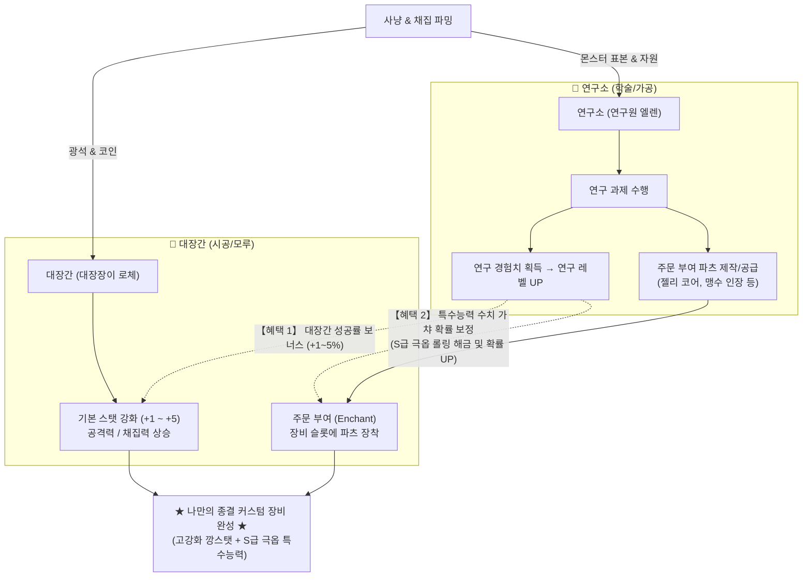

# [기획서] 대장간 기본 스탯 강화 및 연구소 연계 주문 부여(Enchant) 시스템

* **문서 버전**: v1.1
* **작성 일자**: 2026-09-22
* **관련 시설 / NPC**:
  * 대장간: 대장장이 로체 (`Building_Blacksmith`)
  * 연구소: 연구원 엘렌 (`Building_ResearchLab`)
* **핵심 키워드**: 기본 강화, 주문 부여, 주문 부여 파츠, 연구 레벨, 수치 가챠, 데이터 주도(Data-Driven)

---

## 1. 시스템 개요 및 설계 철학

### 1.1 핵심 방향성
1. **장소의 단일화 (유저 동선 최적화)**:
   * 장비에 물리적인 변화를 가하는 모든 작업(**기본 스탯 강화**, **주문 부여**)은 **대장간의 모루(대장장이 로체)**에서만 일괄 진행한다.
2. **연구소의 브레인 역할 (가공 및 품질 보증)**:
   * **연구소(연구원 엘렌)**는 몬스터 표본과 자원을 연구하여 특수능력을 지닌 **'주문 부여 파츠'를 생산**한다.
   * 플레이어가 연구를 거듭해 쌓은 **'연구 레벨'**은 대장간 기본 강화 성공 확률을 영구 보정하고, 주문 부여 시 **최고급 수치(S급 극옵)가 등장할 가능성을 결정하는 핵심 척도**가 된다.
3. **희소성과 엔드 파밍의 재미**:
   * 최상급 특수능력(S급)은 낮은 연구 레벨에서는 사실상 획득이 불가능(0%~0.5%)하며, 연구 만렙을 달성하더라도 **5~6% 수준의 희귀한 대박(극옵)**으로 유지하여 지속적인 파밍과 도전 동기를 부여한다.
4. **완벽한 데이터 주도(Data-Driven) 설계**:
   * 강화 단계별 스탯 및 소모 재료, 주문 부여 옵션 풀 등은 코드 하드코딩 없이 CSV 데이터셋으로 독립 관리한다.

### 1.2 전체 시스템 루프



---

## 2. 대장간 [기본 스탯 강화] 시스템

장비 자체의 기본 물리 성능(공격력, 채집력 등)을 단계별로 상승시키는 시스템입니다.

### 2.1 강화 기본 규칙
* **강화 대상**: 무기(`weapon`), 채집 도구(`axe`, `pickaxe`) 등 장착 장비.
* **성공/실패 판정**:
  * 성공 시: 장비 강화 단계 +1 (공격력/도구 위력 스탯 상승).
  * 실패 시: 강화 단계 유지 (재료 및 비용만 소모되며, 장비 파괴 없음).
* **확률 곡선**:
  * **+1강은 100% 확정 성공**으로 진입 허들을 없앰.
  * 이후 단계부터 성공 확률이 단계적으로 감소.
* **장비 등급별 차등 비용**:
  * 장비의 등급(일반 → 고급 → 희귀)이 높을수록 기본 강화에 필요한 광석/주괴 티어와 코인 비용이 증가.

### 2.2 기본 성공 확률 및 연구 레벨 보정표

| 강화 단계 | 기본 성공 확률 | 연구 레벨 보너스 (최대) | 최종 보정 확률 | 비고 |
|:---:|:---:|:---:|:---:|---|
| **+1** | **100%** | - | **100%** | 확정 성공 |
| **+2** | **70%** | +1% ~ +2% | **72%** | 안정 구간 |
| **+3** | **50%** | +2% ~ +3% | **53%** | 표준 구간 |
| **+4** | **35%** | +3% ~ +4% | **39%** | 도전 구간 |
| **+5** | **20%** | +4% ~ +5% | **25%** | 고급 구간 (엔드) |

### 2.3 무기 및 도구 강화 스탯 설계

#### ① 무기 (Weapon)
무기의 주력 공격 스탯(Attack, MagicAttack, SkillAttack)이 정직하게 단계별로 상승합니다.
* **대장장이의 빅해머 (배틀스미스 - 기본 Atk 16)**: 단계당 `Attack +2` (최대 +5강 시 **Atk 26**)
* **사냥꾼의 투척검 (트래퍼 - 기본 Atk 10, Sk.Atk 4)**: 단계당 `Attack +1`, `SkillAttack +1` (최대 +5강 시 **Atk 15, Sk.Atk 9**)
* **푸른 불씨 완드 (알케미스트 - 기본 M.Atk 12)**: 단계당 `MagicAttack +2` (최대 +5강 시 **M.Atk 22**)
* **네이처 바인 (와일드키퍼 - 기본 Atk 8, Sk.Atk 8)**: 단계당 `Attack +1`, `SkillAttack +1` (최대 +5강 시 **Atk 13, Sk.Atk 13**)

#### ② 채집 도구 (Axe, Pickaxe)
도구는 공격력뿐만 아니라 특정 마일스톤(+3강, +5강)에서 **채집력(`ToolPower`)**이 상승하여 자원 타격 횟수를 획기적으로 줄여줍니다.
* **벌목 도끼 (Axe)**:
  * +1 ~ +2강: `Attack +1 ~ +2`
  * **+3강 달성**: **`ToolPower +1`** 보너스 (자원 타격 횟수 감소)
  * +4강: `Attack +2`
  * **+5강 달성**: **`ToolPower +1` 추가** (최종 ToolPower +2)
* **채광 곡괭이 (Pickaxe)**:
  * +1 ~ +2강: 채광 속도/스태미나 효율 상승
  * **+3강 달성**: **`ToolPower +1`** 보너스 (상위 광석 채굴 속도 대폭 개선)
  * +4강: 채광 크리티컬 확률 보너스
  * **+5강 달성**: **`ToolPower +1` 추가** (최종 ToolPower +2)

---

## 3. 대장간 [주문 부여 (Enchant)] 시스템

연구소에서 연구·제작한 **'주문 부여 파츠'**를 소모하여 장비에 패시브/특수능력을 부여하는 시스템입니다.

### 3.1 주문 슬롯 (Slot) 제한 규칙
* 한 장비에 적용할 수 있는 특수능력의 개수는 장비의 **주문 슬롯 수**로 제한됩니다.
* 장비의 등급에 따라 슬롯 수가 다르게 배정됩니다:
  * **일반 (Common)**: 슬롯 **1개** (예: 돌 도구)
  * **고급 (Uncommon)**: 슬롯 **2개** (예: 구리 도구, 전직 무기)
  * **희귀 / 보스 장비 (Rare / Boss)**: 슬롯 **2 ~ 3개** (예: 철 도구, 보스 드롭 장비)
* 서로 다른 파츠를 조합하여 다양한 시너지 빌드를 구성할 수 있습니다 (예: 슬로우 파츠 + 넉백 파츠).

### 3.2 특수능력 수치 결정 규칙 (연구 레벨 연동 가챠)
주문 부여 시 부여되는 최종 수치는 **5단계 등급(D ~ S급)**으로 구분되며, 그 등장 확률은 **'시도하는 플레이어의 연구 레벨'**에 의해 결정됩니다.

#### ① 5단계 등급 기준 (예시: 점성 젤리 코어 - 둔화)
* **D급 (최하)**: 둔화 5 ~ 7%
* **C급 (일반)**: 둔화 8 ~ 11%
* **B급 (우수)**: 둔화 12 ~ 15%
* **A급 (상급)**: 둔화 16 ~ 20%
* **S급 (종결 극옵)**: **둔화 21 ~ 25%**

#### ② 연구 레벨별 수치 결정 확률 테이블

| 플레이어 연구 레벨 | D급 (최하) | C급 (일반) | B급 (우수) | A급 (상급) | S급 (종결 극옵) | 기획 의도 및 체감 |
|:---:|:---:|:---:|:---:|:---:|:---:|---|
| **Lv. 1** | **70.0%** | 25.0% | 4.9% | 0.1% | **0.0% (잠김)** | 최고 수치 절대 등장 불가 |
| **Lv. 2** | **50.0%** | 35.0% | 13.5% | 1.0% | **0.5% (기적)** | 사실상 획득 불가 수준 |
| **Lv. 3** | **25.0%** | 45.0% | 23.0% | 6.0% | **1.0%** | 극히 낮은 확률로 첫 등장 |
| **Lv. 4** | **10.0%** | 35.0% | 40.0% | 12.0% | **3.0%** | 상위 옵션 본격 도전 구간 |
| **Lv. 5 (최고)** | **5.0%** | 20.0% | 50.0% | 19.0% | **6.0%** | **만렙이어도 20회 중 1회꼴의 귀한 대박!** |

> **고급/보스 전용 특수능력 추가 규칙**:  
> 희귀/보스 전리품으로 만드는 [고급 파츠]는 연구 Lv.1~2에서는 부여 시도 자체가 불가능하며, 연구 Lv.5 기준에서도 S급 확률이 2~3% 수준으로 한층 더 엄격하게 제한됩니다.

---

## 4. 연구소 [주문 부여 파츠] 라인업 예시

| 파츠 명칭 | 연구 선행 조건 및 재료 | 장착 부위 | 부여 특수능력 (연구 레벨에 따라 수치 가변) |
|---|---|---|---|
| **점성 젤리 코어** | 슬라임 젤리 5, 구리 주괴 2 | 무기 | 공격 시 적 이동속도 **5% ~ 25%** 둔화 |
| **야수 돌진의 인장** | 멧돼지 가죽/뼈 5, 철 주괴 2 | 무기 | 공격 시 적 넉백 거리 **+0.5 ~ +2.0 타일** 증가 |
| **포자 독기 룬** | 뿔버섯 갓 5, 약초 5 | 방어구 | 피격 시 공격자에게 **초당 3 ~ 15 독 피해** 반사 |
| **가벼운 깃털 장식** | 질긴 깃털 5, 얇은 가죽 3 | 신발 | 기본 이동속도 **+3% ~ +12%** 영구 증가 |
| **뜰지기의 불씨 핵** | 잠식 파편 1, 정제된 젤리 2 | 무기/장신구 | 잠식형 몬스터 대상 추가 피해 **+5% ~ +20%** |

---

## 5. 데이터 주도(Data-Driven) 사양 정의

### 5.1 장비 기본 강화 데이터셋: `EquipmentEnhanceDataSet.csv`
코드 하드코딩 없이 장비별/단계별 강화 스탯 및 요구 재료를 독립 정의합니다.

```csv
EnhanceKey,ItemId,Level,SuccessRate,CostCoin,CostItem,CostItemCount,AddAttack,AddMagicAttack,AddSkillAttack,AddToolPower
smith_hammer_1,smith_hammer,1,100,20,Copper Bar,2,2,0,0,0
smith_hammer_2,smith_hammer,2,70,40,Copper Bar,3,2,0,0,0
smith_hammer_3,smith_hammer,3,50,80,Iron Bar,2,2,0,0,0
smith_hammer_4,smith_hammer,4,35,150,Iron Bar,3,2,0,0,0
smith_hammer_5,smith_hammer,5,20,300,Iron Bar,5,2,0,0,0
alchemy_wand_1,alchemy_wand,1,100,20,Copper Bar,2,0,2,0,0
alchemy_wand_2,alchemy_wand,2,70,40,Copper Bar,3,0,2,0,0
alchemy_wand_3,alchemy_wand,3,50,80,Iron Bar,2,0,2,0,0
alchemy_wand_4,alchemy_wand,4,35,150,Iron Bar,3,0,2,0,0
alchemy_wand_5,alchemy_wand,5,20,300,Iron Bar,5,0,2,0,0
iron_pickaxe_1,iron_pickaxe,1,100,30,Iron Bar,2,0,0,0,0
iron_pickaxe_2,iron_pickaxe,2,70,60,Iron Bar,3,0,0,0,0
iron_pickaxe_3,iron_pickaxe,3,50,120,Iron Bar,4,0,0,0,1
iron_pickaxe_4,iron_pickaxe,4,35,250,Iron Bar,5,0,0,0,0
iron_pickaxe_5,iron_pickaxe,5,20,500,Iron Bar,8,0,0,0,1
```

### 5.2 주문 부여 파츠 데이터셋: `EnchantPartDataSet.csv`
파츠별 부여 가능 부위, 스탯 타입, 등급별 수치 범위 정의.

```csv
PartId,DisplayName,TargetSlot,StatType,ValD_Min,ValD_Max,ValC_Min,ValC_Max,ValB_Min,ValB_Max,ValA_Min,ValA_Max,ValS_Min,ValS_Max,MinResearchLv
enchant_slime_core,점성 젤리 코어,weapon,SlowRate,5,7,8,11,12,15,16,20,21,25,1
enchant_boar_crest,야수 돌진의 인장,weapon,KnockbackDist,0.5,0.7,0.8,1.1,1.2,1.5,1.6,1.8,1.9,2.0,1
enchant_mushroom_rune,포자 독기 룬,armor,PoisonReflect,3,5,6,8,9,11,12,13,14,15,2
enchant_gloom_ember,뜰지기의 불씨 핵,weapon,GloomBane,5,7,8,11,12,15,16,18,19,20,3
```

### 5.3 연구 레벨별 가중치 테이블: `EnchantWeightDataSet.csv`
연구 레벨에 따라 D ~ S 등급이 뽑힐 확률 가중치 관리.

```csv
ResearchLevel,WeightD,WeightC,WeightB,WeightA,WeightS
1,700,250,49,1,0
2,500,350,135,10,5
3,250,450,230,60,10
4,100,350,400,120,30
5,50,200,500,190,60
```

---

## 6. 향후 구현 단계 안내

1. **Phase 1: 데이터셋 구축**
   * `EquipmentEnhanceDataSet.csv`, `EnchantPartDataSet.csv`, `EnchantWeightDataSet.csv` 생성 및 등록.
2. **Phase 2: 연구소 연구 레벨링 연결**
   * `ResearchDataSet`에 `ExpGain` 컬럼 추가, 연구 완료 시 `UserResearchData`의 Exp/Lv 상승 및 영속 저장.
3. **Phase 3: 대장간 모루 UI 및 강화/주문 부여 로직 구현**
   * 대장장이 로체 상호작용 시 열리는 대장간 모루 UI 제작 (기본 강화 탭 / 주문 부여 탭).
   * 연구 레벨을 참조한 성공 확률 및 가챠 롤링 로직 서버 검증.
