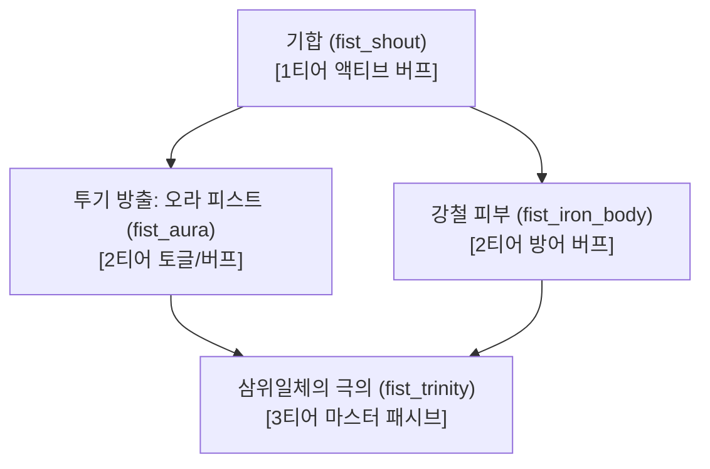

# [기획/설계서] 히든 직업 「맨주먹 파이터」 & 대왕 슬라임젤리 히든 퀘스트

---

## 1. 개요 및 기획 의도

- **콘셉트**: 화려한 무기나 마법에 의존하지 않고, 자신의 살과 뼈를 단련해 맨손과 장갑만으로 세상과 맞서는 낭만의 히든 직업.
- **해금 트리거**: 무직(`novice`) 상태에서 보스 몬스터 '슬라임킹'을 쓰러뜨리고 얻은 **「대왕 슬라임젤리 (Large Slime Jelly)」**를 소지한 채 촌장(Elder)과 조우.
- **핵심 특징**:
  1. **촌장의 숨겨진 과거**: 지팡이를 짚고 허허 웃던 촌장이 과거 청춘 시절 맨주먹 하나로 대륙을 누볐던 전설의 '맨주먹 파이터'였음이 드러남.
  2. **모험가 기본 스킬의 강화**: 새로운 스킬만 쓰는 게 아니라, 기존 모험가 기본기(파워 스트라이크, 대시, 회복)가 주먹과 격투술에 맞게 극적으로 진화.
  3. **자가 버프(Self-Buff) 중심 메카닉**: 기합, 투기 방출, 강철 피부 등 자신을 강화하여 폭발적인 타격감과 연타력을 발휘.
  4. **삼위일체 밸런스 스탯**: 단일 스탯 올인이 아닌, **STR(완력) + DEX(기교) + VIT(체력)**의 균형 잡힌 분배가 최고의 시너지를 내는 독창적 성장 구조.
  5. **무기 체계**: 주무기 슬롯을 비우거나 **장갑(Glove / Gauntlet)**을 착용하여 전투.

---

## 2. 스토리라인 & NPC 대화 시나리오

### 2.1 내러티브 배경 (촌장의 숨겨진 과거)
> *"도구와 무기는 손에 쥐는 순간 부러질까 두려워지는 법이지. 하지만 매일 단련한 두 주먹은 주인이 숨을 쉬는 한 결코 부러지지 않는다네."*
>
> 흙 벌판 마을의 온화한 촌장 루카스. 그는 늙고 지팡이를 짚고 다니며 개척단의 안전만 걱정하는 노인으로 보이지만, 사실 40년 전 빅토리아 아일랜드 전역에 이름을 떨쳤던 초대 개척단의 선봉장, **「붉은 너클의 루카스」**였다. 
> 그는 무기 하나 없이 맨주먹에 붕대와 낡은 가죽 장갑만 감고 거대한 골렘을 깨부수고 슬라임킹을 맨손으로 찢어발겼던 전설적인 맨주먹 파이터였다.
> 세월이 흘러 평화로운 촌장으로 살아가며 주먹을 봉인했지만, 무직 상태의 모험가가 맨몸으로 슬라임킹을 격파하고 가져온 농축된 거대 젤리를 본 순간, 잊고 있던 청춘의 투지가 다시 요동치기 시작한다.

---

### 2.2 대화 스크립트 전문 (UIDialogController 연동)

#### [Quest 341] 촌장의 잊혀진 과거 (수락 및 이벤트 대화)
- **발동 조건**: `JobId == ""` (무직) AND 인벤토리에 `Large Slime Jelly >= 1` 보유
- **화자**: 촌장 루카스 (`elder`)

```text
[페이지 1 - 놀람과 당황]
(촌장이 당신의 주머니 속에서 뿜어져 나오는 묵직한 푸른빛을 보더니 눈을 휘둥그레 뜬다.)
"자, 잠깐... 자네 손에 든 건... 슬라임킹의 대왕 슬라임젤리가 아닌가?!"
"보통 녀석이 아니었을 텐데, 그걸 쓰러뜨리고 통째로 뜯어왔단 말인가?"

[페이지 2 - 의문]
"...그런데 왜 이걸 대장간의 로체나 연구소의 엘렌이 아니라 나한테 가져온 게야?"
"연금술 촉매로 쓰든, 단련용 담금질에 쓰든 다른 녀석들에게 가면 거금을 쳐줄 텐데..."

[페이지 3 - 눈치챔 & 잊혀진 과거]
"...잠깐."
(촌장이 당신의 거친 손과 장비를 훑어본다. 칼도, 도끼도, 지팡이도 쥐지 않은 채 굳은살이 박인 빈손이다.)
"자네... 설마 무기 없이 그 거대한 녀석과 맞선 건가?"
"허... 헛소문인 줄 알았더니... 40년 전 마을 뒷골목에 떠돌던 내 옛이야기를 듣고 온 게로군 그래."

[페이지 4 - 회상과 피 끓는 투지]
"그래... 다들 칼날의 날카로움이나 마법의 화려함만 좇을 때, 나는 오직 이 두 주먹만을 믿었지."
"무기 따위는 손에 쥐는 순간 언젠가 부러질까 두려워지지만, 매일 단련한 뼈와 살은 결코 배신하지 않는 법."
"이 늙은이의 가슴속 굳은살 아래에서... 잊고 살았던 불꽃이 다시 튀는구먼. 자네, 나와 같은 '맨주먹'의 정신을 품고 있군!"

[페이지 5 - 제안 (선택)]
"화려한 쇳덩이에 영혼을 맡기지 않고, 자네 자신의 육체를 최강의 무기로 벼려보겠나?"
"내 모든 것을 전수해주지. 세상에 단 하나뿐인 길, '맨주먹 파이터'의 길을 걷겠는가?"

[수락 시]
"좋아! 눈빛이 마음에 드는군! 그 질긴 젤리를 내게 넘겨주게. 자네의 주먹을 위한 첫 단련을 시작하지!"
[거절 시]
"음... 아직 망설여지는 모양이군. 괜찮네. 주먹 하나로 거친 세상을 헤쳐 나가는 건 쉬운 길이 아니니까."
```

#### [Quest 342] 맨주먹의 증명 (전직 완료 대화)
- **완료 보고 시 대사**:
```text
[페이지 1 - 전직]
"크하하! 젤리의 탄성을 맨손으로 찢어내던 그 악력과 패기, 확실히 증명되었네!"
"오늘부터 자네는 메이플 월드의 유일무이한 '맨주먹 파이터'일세!"

[페이지 2 - 비전 전수 & 가죽 장갑 증정]
"자, 이건 내가 젊은 시절 슬라임킹과 바위 골렘을 두들겨 팰 때 끼던 낡은 '가죽 장갑'일세."
"장갑은 손을 보호하는 방어구이자, 주먹의 파괴력을 적의 뼈마디까지 전달하는 최고의 흉기지!"

[페이지 3 - 촌장의 핵심 조언 (스탯 밸런스 힌트)]
"그리고 명심하게나! 맨주먹 파이터는 단순히 힘(STR)만 무식하게 세다고 완성되는 게 아니야."
"상대의 틈을 파고드는 날렵한 기교(DEX), 그리고 어떤 연타도 묵묵히 버텨내는 강철 같은 체력(VIT)이 완벽한 조화를 이룰 때 비로소 진정한 파괴력이 폭발하는 법일세!"
"스킬창(K)을 열어보게. 자네의 몸속에 잠들어 있던 격투 본능이 깨어났을 걸세!"
```

---

## 3. 퀘스트 데이터 파이프라인 설계

기존 `QuestDataSet.csv` 체계(301~303 트래퍼, 311~313 배틀스미스, 321~323 알케미스트, 331~333 와일드키퍼)를 완벽히 계승하여 **341~343**번 대역으로 배치합니다.

| Id | Name | Desc | ProgressingDesc | CategoryEnum | RequiredId | AutoAccept | CannotAbandon | ConsumeItems | RewardItems | GiverNpcId | TurnInNpcId | RequiredLevel | RequiredJobId | RewardJobId | RewardSP |
|---|---|---|---|---|---|---|---|---|---|---|---|---|---|---|---|
| **341** | 촌장의 잊혀진 과거 | 슬라임킹에게서 얻은 대왕 젤리를 촌장에게 보여주자, 촌장이 놀란 눈으로 바라봅니다. | 대왕 슬라임젤리를 챙겨 마을의 촌장에게 말을 거세요. | Sub | 107 | X | O | | | elder | elder | 4 | novice | | 1 |
| **342** | 맨주먹 파이터: 맨주먹의 증명 | 무기를 버리고 두 주먹으로 세상과 맞서는 전설의 맨주먹 파이터 전직 시험입니다. 대왕 젤리를 바치고 전직을 확정하세요. | 대왕 슬라임젤리 1개를 촌장에게 전하고 맨주먹 파이터로 전직하세요. | Sub | 341 | X | O | Large Slime Jelly:1 | Leather Gloves:1 | elder | elder | 6 | novice | **barefist_fighter** | 5 |
| **343** | 맨주먹 파이터의 실전: 기합과 투혼 | 맨주먹 파이터의 첫 자가 버프 기술을 익히고 실전에서 시험해 보세요. | 스킬창(K)에서 기합을 배우고 들판의 슬라임 5마리를 주먹으로 처치한 뒤 촌장에게 보고하세요. | Sub | 342 | O | O | | Coin:100 | elder | elder | 6 | barefist_fighter | | 3 |

### 3.1 퀘스트 발생/노출 조건 체크 파이프라인
1. **발생 조건 트리거**:
   - `PlayerController.JobId == ""` (무직)
   - `PlayerInventory:GetItemCount("Large Slime Jelly") >= 1`
2. **NPC 퀘스트 알림 아이콘**:
   - 위 조건 충족 시 마을의 `elder` 엔티티 머리 위에 히든 퀘스트 마크(주황색/황금색 느낌표) 표시.
3. **타 직업 배타성**:
   - 기존 직업 전직(302, 312, 322, 332)과 마찬가지로 342 퀘스트 완료 시 `UserQuestData:GrantJob("barefist_fighter")`가 호출되어 타 직업 퀘스트는 자동 포기/잠금 처리됨.

---

## 4. 직업 메카닉 & 스탯 시스템 설계

### 4.1 무기 & 장비 착용 메카닉
- **장비 슬롯**: `gloves` (장갑)
- **전투 메카닉**:
  - 주무기(`weapon`)를 착용하지 않은 상태(맨손)이거나 장갑(`gloves`)을 착용한 상태에서 기본 공격(Ctrl) 시 고유 타격 판정 및 주먹 타격음/이펙트 출력.
  - 장갑 아이템의 **방어력 및 강화 수치가 일정 비율(예: 방어력의 150%)만큼 맨주먹 공격력으로 변환**되어 장갑이 무기 역할을 겸함.

---

### 4.2 스탯 밸런스 공식: 「삼위일체의 조화 (Trinity Balance)」
> *"밸런스 있는 스탯의 조합이 효율적이어야 한다."*

다른 직업군이 단일 스탯(배틀스미스 STR, 트래퍼 DEX, 알케미스트 INT, 와일드키퍼 SPI)에 100% 투자할 때 가장 높은 효율을 내는 것과 달리, **맨주먹 파이터는 3대 체력/신체 스탯(STR, DEX, VIT)을 고르게 투자할수록 기하급수적인 시너지가 발생**하도록 설계합니다.

#### [시너지 메카닉 공식]
```lua
-- 삼위일체 균형 지수 (Harmony Factor)
-- 세 스탯의 최소값(Min)과 평균값(Avg)의 비율로 균형도를 산출
local minStat = math.min(strPts, dexPts, vitPts)
local avgStat = (strPts + dexPts + vitPts) / 3.0
local balanceRatio = 1.0
if avgStat > 0 then
    balanceRatio = minStat / avgStat -- 0.0 (완전 불균형) ~ 1.0 (완벽한 1:1:1 균형)
end

-- 최종 추가 보너스:
-- 1) 균형 보너스 공격력: minStat * 2.5
-- 2) 자가 버프 지속시간 및 효과: balanceRatio * 35% 증폭
-- 3) 넉백 저항 및 방어 관통: balanceRatio * 20% 부여
```
- **스탯별 역할**:
  - **STR (완력)**: 기본 주먹 묵직함, 타격 시 적 밀쳐냄 및 추가 물리 공격력.
  - **DEX (기교)**: 주먹 스윙 딜레이 감소(공속 증가), 크리티컬 확률 증가, 캔슬 스텝 유연성.
  - **VIT (체력/근성)**: 최대 HP 증가, 피격 피해 감소, 자가 버프 지속 중 체력 재생, 장갑 방어력의 공격력 전환율 증가.
- **결과**: STR에만 30포인트를 몰아준 캐릭터보다, **STR 10 / DEX 10 / VIT 10**으로 고르게 분배한 맨주먹 파이터가 공격력 +25, 버프 효과 +35%, 크리티컬 +10%를 추가로 얻어 훨씬 강력해짐!

---

### 4.3 모험가 기본 스킬 강화 메카닉

맨주먹 파이터는 기존 모험가 기본 스킬들이 '격투가 버전'으로 자동 오버라이드 및 강화됩니다.

| 기존 기본 스킬 | 맨주먹 파이터 전직 후 변화 | 강화 효과 (Synergy Enhancement) |
|---|---|---|
| **파워 스트라이크** (`power_strike`) | **묵직한 정권 지르기 (Heavy Straight)** | 무기 스윙 대신 전방으로 묵직한 정권을 내지름. <br>• 타격 범위 전방 1.5배 및 방어력 15% 무시.<br>• 타격 성공 시 적에게 1초간 경직(Hit-Stun) 부여. |
| **플래시 점프** (`dash`) | **인파이트 스텝 (Infight Step)** | 허공 도약 대신 지면을 박차고 전방으로 초고속 돌진.<br>• 돌진 경로 상의 적과 충돌 시 적을 옆으로 밀쳐내며 0.5초 기절.<br>• 돌진 직후 다음 기본 타격 데미지 50% 증폭. |
| **회복** (`recovery`) | **불굴의 투혼 (Second Wind)** | 비전투 회복량 2배 증가.<br>• 전투 중 HP가 30% 이하로 내려가면 즉시 기력 100% 회복 및 4초간 슈퍼아머(넉백 면역) 발동 (쿨다운 60초). |

---

### 4.4 신규 직업 스킬 트리 (자가 버프 중심)

`SkillDataSet.csv`에 추가될 `barefist_fighter` 전용 스킬 4종입니다.



#### 1) 기합 (Battle Shout) - `fist_shout`
- **타입**: Buff (액티브)
- **쿨다운**: 20초 / 소모 MP: 15 / 지속시간: 12초
- **효과**: 가슴 깊은 곳에서 기합을 내질러 전신을 각성시킵니다.
  - 공격력 +15% (+레벨당 3%), 이동속도 +15%
  - STR 수치에 비례하여 공격력 추가 증가, DEX 수치에 비례하여 공격 속도 증가.

#### 2) 투기 방출: 오라 피스트 (Aura Fist) - `fist_aura`
- **타입**: Buff / Stance (액티브)
- **쿨다운**: 15초 / 소모 MP: 20 / 지속시간: 10초
- **선행**: `fist_shout` (Lv 1 이상)
- **효과**: 주먹에 응축된 투기를 둘러 기본 타격 및 정권 지르기를 폭발시킵니다.
  - 주먹 공격 시 100% 확률로 2연타 타격 발생 (추가타는 60% 위력).
  - 공격 시마다 기력(Stamina) 5씩 회복.

#### 3) 강철 피부 (Iron Will / Body) - `fist_iron_body`
- **타입**: Buff (액티브)
- **쿨다운**: 25초 / 소모 MP: 18 / 지속시간: 8초
- **선행**: `fist_shout` (Lv 1 이상)
- **효과**: 근육을 강철처럼 수축시켜 적의 공격을 온몸으로 받아냅니다.
  - 받는 모든 피해 35% (+레벨당 5%) 감소.
  - 피격 시 넉백 완전 면역 (슈퍼아머).
  - VIT 수치에 비례하여 반사 데미지(받은 피해의 40%)를 근접 적에게 반사.

#### 4) 삼위일체의 극의 (Trinity Mastery) - `fist_trinity`
- **타입**: Passive
- **선행**: `fist_aura` (Lv 2), `fist_iron_body` (Lv 2)
- **효과**: 힘, 기교, 체력이 완전한 조화를 이루어 인간의 한계를 초월합니다.
  - STR/DEX/VIT의 균형도가 높을수록 모든 자가 버프 지속시간 최대 +40% 증가.
  - 기본 공격 및 기본 스킬의 쿨다운 20% 감소.
  - 크리티컬 확률 +15%, 크리티컬 피해 +30%.

---

## 5. Claude 작업 가이드 및 핸드오프 (Hand-off) 스펙

이 문서를 바탕으로 Claude가 실제 코드/데이터베이스 적용 작업을 진행할 수 있도록 아래 상세 작업 단위(Work Packages)를 제시합니다.

### WP 1. 퀘스트 데이터 등록 (`QuestDataSet.csv`)
- 341, 342, 343 퀘스트 행 추가 (본 문서 제3절 표 참고).
- 대왕 슬라임젤리(`Large Slime Jelly:1`) 소모 조건 및 직업 보상(`RewardJobId = "barefist_fighter"`) 설정.

### WP 2. 스킬 데이터 등록 (`SkillDataSet.csv`)
- `fist_shout`, `fist_aura`, `fist_iron_body`, `fist_trinity` 4개 스킬 행 작성.
- `JobId` = `barefist_fighter`, `JobName` = `맨주먹 파이터`.
- **Claude 위임**: 메이플 월드 내 격투가/버프 이펙트 RUID 및 사운드 RUID 검색 후 매핑 (예: 버카니어 기합/오라, 바이퍼 에너지 차지 계열).

### WP 3. 촌장 대화 스크립트 연결 (`UIDialogController.mlua` / `VillagerDialog.mlua`)
- 무직 상태 + 대왕 슬라임젤리 보유 시 촌장의 341 퀘스트 우선 팝업 처리.
- 본 문서 제2.2절 대화 전문 페이징 연동.

### WP 4. 스탯 밸런스 공식 & 장갑 공격력 로직 반영 (`PlayerController.mlua`)
- `GetJobName("barefist_fighter")` -> "맨주먹 파이터" 확인.
- `CalcEquipBonus()` 및 `GetStatAttackTotal()`에서 맨주먹 파이터 전용 장갑 방어력 공격력 전환 로직 및 삼위일체(STR+DEX+VIT) 조화 보너스 연산 함수 추가.
- `power_strike`, `dash` 시전 시 맨주먹 파이터 조건 분기 처리 (투기 이펙트 및 정권 모션).

---

## 6. 기대 효과 및 플레이 경험

1. **발견의 쾌감 (히든 요소)**: 보스 슬라임킹을 잡고 얻은 희귀 전리품을 무직 상태로 촌장에게 가져갔을 때 열리는 예상치 못한 스토리텔링과 히든 전직.
2. **독특한 파밍/육성 재미**: 무기 파밍에 매달리지 않고, 질 좋은 장갑을 모으고 STR/DEX/VIT을 정밀하게 분배하며 성장하는 독자적인 빌드 구축.
3. **손맛과 액션성**: 자가 버프들을 켜고 적진에 뛰어들어 빠른 연타와 정권 지르기로 몬스터들을 격파하는 통쾌한 인파이터 액션 구현.

---

## 7. 구현 검증 결과 & 확정 사양 (2026-09-26) — ⚖️ 이 절이 §3~§5 보다 우선

§1~§6 초안을 실제 코드·데이터와 대조한 결과와, 구현된 확정 사양이다. 작업 기록은 [tasks.md](../tasks.md) 2026-09-26 항목.

### 7.1 초안에서 발견한 문제와 조치

| # | 문제 | 조치 |
|---|---|---|
| 1 | §3 표가 실제 `QuestDataSet` 열 순서와 다르다(`LinkedPrevId`·`Priority`·`RewardUnlockId` 누락, 341 선행을 `RequiredId` 로 표기). 조건 행(`QuestConditionDataSet`)도 없다 | 실제 열 순서로 작성, 선행은 다른 직업처럼 `LinkedPrevId`. 조건 4행 추가 |
| 2 | "젤리 보유 시에만 제안"을 표현할 수단이 퀘스트 시스템에 없다 | `QuestDataSet.RequiredHaveItems` 열 신설 — 수락 자격에만 적용(보고 자격 무관). 촌장 마크는 주황 "!" |
| 3 | "대왕 슬라임젤리"라는 아이템이 없다 | 기존 `Large Slime Jelly`(대형 슬라임 젤리) 사용. 대사도 "대형"으로 통일 |
| 4 | 자가 버프 스킬 타입이 없다(시전 타입은 Melee/Ultimate/Dash/Projectile/Trap/Field/Guard/HealAura뿐) | `Buff` 타입 + `SkillDataSet.BuffIds`(BuffDataSet 적용) 신설 |
| 5 | **슬롯 4칸인데 모험가 공격 스킬이 이미 3개 — 액티브 버프 3개는 쓸 수 없다** (제작자 지적) | 기합만 액티브. 투기 방출·강철 피부는 슬롯 없는 자동 발동 패시브(`SkillDataSet.Trigger`) |
| 6 | 크리티컬 시스템이 없다 | 삼위일체의 극의에서 크리티컬 제거 → 쿨다운 감소로 대체 |
| 7 | §4.2 공식이 과하다: `minStat×2.5` 는 능력치 1당 공격력 0.5 인 현 체계의 5배. 10/10/10 이 +25 인데 타 직업 힘 30 은 +15 이고, 체력의 HP·방어까지 얹힌다. §4.2 결과 예시의 "크리 +10%"는 공식에 없다 | 유효 포인트 = (힘+솜씨+체력) × (0.5 + 0.7×균형도). ⚖️ 제작자 결정: 특수 기믹 없는 싸움 특화 직업이므로 1:1:1 이면 타 직업 몰빵보다 **20% 강하게**(×1.2), 한쪽 몰빵이면 절반(×0.5) |
| 8 | 기본 스킬 "자동 오버라이드" 장치가 없고, 몬스터 상태이상은 스킬 행 단위(`Status`)로만 붙는다 | `SkillDataSet.JobVariantOf` 직업 변형 행 — 레벨·쿨다운·비용·슬롯은 원본, 타입·배율·상태이상·이펙트는 변형 행 |
| 9 | 삼위일체의 극의의 선행이 2개인데 `ParentSkillId` 는 하나뿐 | 선행 = 강철 피부 Lv2 하나 |
| 10 | "주먹으로 처치" 조건은 판정할 수 없다 | 슬라임 5마리 처치(다른 직업 x03 과 동일) |
| 11 | 정권의 "방어력 15% 무시"와 인파이트 스텝의 "옆으로 밀쳐냄"은 현재 전투 장치로 스킬당 상태이상 하나와 겹쳐 표현할 수 없다 | 이번 범위에서 제외(기절만 적용) |

### 7.2 확정 퀘스트

| Id | 이름 | 선행 | 자격 | 조건 | 보고 시 | 보상 |
|---|---|---|---|---|---|---|
| ~~341~~ | ~~촌장의 잊혀진 과거~~ — **2026-10-03 비활성(`Disable=O`), 342 에 병합** | | | | | |
| 342 | 맨주먹 파이터의 시험: 맨주먹의 증명 (히든) | 107 | Lv6 · 무직 · **대형 슬라임 젤리 지참** | 젤리 1 지참(Have) | 젤리 1 소모 | 가죽 장갑 · SP 6 · 경험치 450 · **전직** (타 직업 시험 포기) |
| 343 | 맨주먹 파이터의 실전: 기합과 투혼 (자동 수락) | 342 | 맨주먹 파이터 | 기합 배우기 · 슬라임 5 | — | 코인 100 · SP 3 · 투기 방출 해금 |

⚖️ 2026-10-03 제작자 피드백 "수락을 한 번 해도 다음 권유가 또 들어온다" → 341(히든 제안)과 342(전직 시험)가 같은 젤리 지참 조건으로 **수락을 두 번** 받던 구조를 342 하나로 합쳤다. 흐름: 주황 "!" → 제안 6쪽(옛 341 이야기 + 타 직업 시험 포기 경고) → **수락 1번** → 다시 말 걸기 → 보고 4쪽 + 전직. 보상은 두 퀘스트 합(SP 1+5 · 경험치 150+300). 341 을 이미 깬 세이브도 342 를 그대로 받는다(선행이 107 이라). 341 진행 중이던 세이브의 341 기록은 데이터가 없어 화면·판정에서 무시된다.

대사: 342 `offer` 6쪽(§2.2 페이지 1~5 압축 + 포기 경고) · `accept`/`decline`(§2.2 수락/거절 대사) · `progress` · `complete` 4쪽(옛 341 보고 1쪽 + §2.2 Quest 342). CSV 쉼표 금지 규칙(규칙 51)으로 대사 안의 쉼표는 뺐다.

### 7.3 확정 스킬 (JobId `barefist_fighter`)

| 스킬 | 타입 · 발동 | 효과 |
|---|---|---|
| 기합 `fist_shout` | **Buff (슬롯)** · 쿨 20초(레벨당 −2) · MP 15 | 12초: 공격력 +15%(`AttackPct`) · 이동 속도 ×1.15 · 공격·채집 속도 ×1.15 · **기력 회복 ×4**(`StaminaRegen` — 초당 2 → 8, 2026-10-03 제작자 요청) |
| 투기 방출: 오라 피스트 `fist_aura` | 패시브 · `OnParentCast`(기합 시전 시) · 343 완료 후 | 12초: 평타가 60% 위력 추가타 1회 · 평타마다 기력 +5 |
| 강철 피부 `fist_iron_body` | 패시브 · `OnParentTrigger`(**불굴의 투혼 발동 시 연쇄**) · 선행 회복 Lv1 | 8초: 받는 피해 −35% · 넉백·경직 무시 · 근접 공격자에게 받은 피해 40% 반사(레벨당 +10%) |
| 삼위일체의 극의 `fist_trinity` | 패시브 · 선행 강철 피부 Lv2 · Lv8 | 자가 강화 지속시간 레벨당 +13% × 균형도 · 모든 스킬 쿨다운 레벨당 −7% |

**모험가 기본 스킬 변형** (`JobVariantOf`, 스킬창에서는 원본 칸에 변형 이름·설명으로 표시):

| 원본 | 변형 | 효과 |
|---|---|---|
| 파워 스트라이크 | 묵직한 정권 지르기 | 배율 1.6(레벨당 +0.3) · 사거리 1.5배 · 1초 기절(보스는 둔화) · 삼위일체 계열 |
| 플래시 점프 | 인파이트 스텝 | 물리 돌진 배율 1.2 · 0.5초 기절 · 3초 안의 다음 평타 +50% |
| 회복 | 불굴의 투혼 | 비전투 회복 2배(레벨×4%) · HP 30% 이하 피격 시 기력 전량 + 4초 슈퍼아머(재사용 60초) → 강철 피부 연쇄 |

권장 슬롯: Q 기합 · W 정권 · E 인파이트 스텝 · R 슬래시 블러스트(또는 주먹도끼 던지기).

**판정·이펙트 (2026-10-03 제작자 피드백 "이펙트 위치·판정이 작다" 반영)** — `SkillDataSet` 신규 열 `AreaWidth`(좌우 폭)·`EffectFacing`(원본 그림 방향).

| 스킬 | 판정 (전) | 판정 (후) | 이펙트 (전 → 후) |
|---|---|---|---|
| 묵직한 정권 지르기 | 3×3 정사각, 중심 앞 2.4 → 몸 앞 0.9칸이 빈칸(붙은 적 헛침) | 앞 0~4.5 × 폭 3 (원본 파워 스트라이크 0.1~3.1 의 1.5배) | 스크류 펀치 원본이 **오른쪽을 보는** 리소스인데 왼쪽 규약으로 반전돼 드릴이 등 뒤로 뻗음 → `EffectFacing=right`, 위·아래 시전은 90° 세움. 후속(같은 날 Play 피드백 "등 뒤에서 발사되는 느낌"): 원본이 배율 1 캐릭터 기준이라 배율 2.8 플레이어에선 꼬리가 등 뒤·정강이 높이 → 드릴 꼬리를 `stabO1` 주먹 위치에 맞춤(`EffectOffset 1.7` · `EffectHeight 0.6` · 배율 1.1, 임팩트 ≈ 앞 4.6). 시전 모션 `swingO2`(휘두르기) → `stabO1`(찌르기) |
| 인파이트 스텝 | 경로 ±1.2 | 경로 ±1.5 (`AreaWidth 3`) | 발밑 회오리 — 변경 없음 |
| 붉은 너클의 일격 | 원 반지름 1.1, 중심 앞 1.6 (앞 0.5~2.7) | 원 반지름 1.7 (`AreaSize 3.4`, 앞 −0.1~3.3) | 착탄 이펙트가 방향 무시·장판 중심에 찍혀 오른쪽 시전 때 거꾸로 → `EffectFacing=left`, 시전 위치에서 시전 방향으로(주먹 연타 ≈ 앞 3.2) |

### 7.4 삼위일체 능력치 & 장갑

- 유효 포인트 = (힘 + 솜씨 + 체력) × (`TrinityBaseFactor` 0.5 + `TrinityBalanceFactor` 0.7 × 균형도), 균형도 = 최솟값 / 평균.
- AP 30 예시 (타 직업 힘 30 = 계열 공격력 +15): 10/10/10 → +18 (**+20%**) · 12/10/8 → +15.5 (약 +3%) · 15/15/0 또는 30/0/0 → +7.5 (−50%).
- 싸움 특화 설계 의도: 다른 직업의 전용 기믹(덫·갑주 파쇄·산성·동물) 대신, 고르게 찍으면 순수 전투 수치가 앞선다. 체력 투자분의 HP·방어력은 별도로 얻는다.
- 삼위일체 계열 공격력 = 기본 + 레벨 성장 + 유효 포인트 × 0.5 + **장갑 방어력 × `GloveAttackRatio`(1.5)**. 무기 공격력은 더하지 않는다(맨주먹).
- 파이터의 평타(Ctrl)도 이 계열을 쓴다(`PlayerController.BasicAttackStatByJob`). 튜닝값은 모두 `PlayerController` 인스펙터 프로퍼티.
